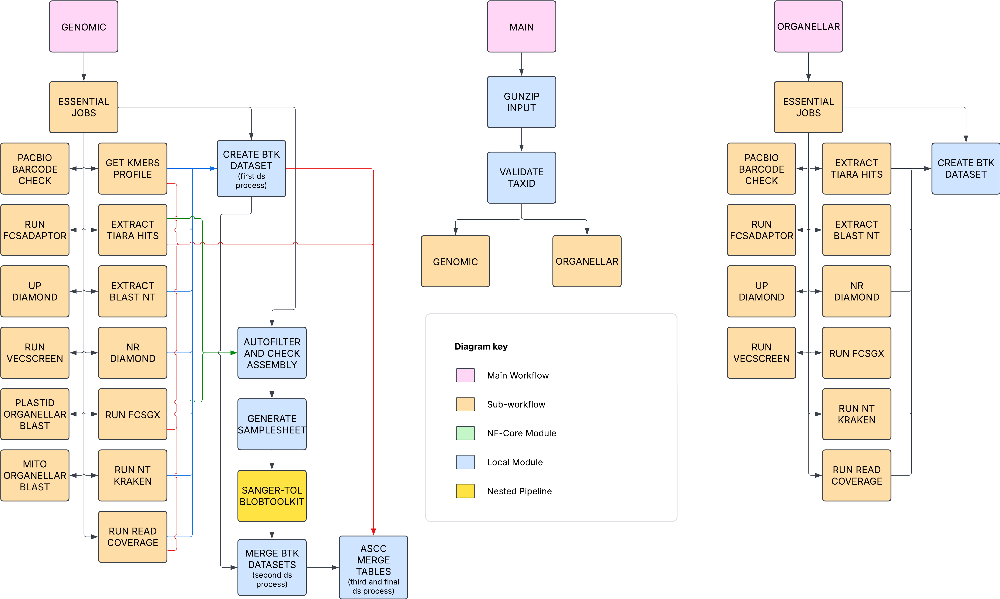

# sanger-tol/ascc

[](https://github.com/sanger-tol/ascc/actions/workflows/ci.yml)
[](https://github.com/sanger-tol/ascc/actions/workflows/linting.yml)[](https://doi.org/10.5281/zenodo.XXXXXXX)
[](https://www.nf-test.com)

[](https://www.nextflow.io/)
[](https://docs.conda.io/en/latest/)
[](https://www.docker.com/)
[](https://sylabs.io/docs/)
[](https://cloud.seqera.io/launch?pipeline=https://github.com/sanger-tol/ascc)

---

## Introduction

**sanger-tol/ascc** is a bioinformatics pipeline that is meant for detecting cobionts and contaminants in genome assemblies. ASCC stands for Assembly Screen for Cobionts and Contaminants. The pipeline was initially made for the Aquatic Symbiosis Genomics project but is now used for more than just that. The pipeline aggregates tools such as BLAST, GC and coverage calculation, FCS-adaptor, FCS-GX, VecScreen, BlobToolKit, the BlobToolKit pipeline, Tiara, Kraken, Diamond BLASTX, and kmer counting and with kcounter+scipy. The main outputs are:

- A CSV table with taxonomic classifications of the sequences from the consitutent tools.
- A BlobToolKit dataset that can contain variables that are not present in BlobToolKit datasets produced by the BlobToolKit pipeline (https://github.com/sanger-tol/blobtoolkit) on its own. For example, ASCC can incorporate FCS-GX results into a BlobToolKit dataset.
- Individual report files for adapter, PacBio barcode and organellar contaminants.
  The only required input file for ASCC is the assembly FASTA file. Optional inputs are sequencing reads and organellar FASTA files. All individual components of the pipeline are optional, so it is possible to do lightweight runs with assemblies that have a simple composition of species and comprehensive runs with assemblies with complex composition.



The pipeline is in a raw state of development and has not yet been thorougly tested. Its components are functional, though, so it possible to run it.

1. Run a selection of processes from the list below (pick any that you think will be useful).

- FCS-GX
- FCS-adaptor
- VecScreen
- Tiara
- BlobToolKit Pipeline
- nt BLAST
- nr and Uniprot Diamond BLASTX
- GC and coverage calculation
- PacBio barcodes screen
- Organellar BLAST
- nt Kraken2
- kmer counting + dimensionality reduction

2. Postprocess the results of the previous step to produce summary files. What processes were run in the previous step determines what summary files can be generated. The possible outputs are:

- CSV table of sequence classification results
- BlobToolKit dataset
- CSV table of average coverage per phylum
- Adapter and organellar contamination report files

There is a Biodiversity Genomics Academy video that introduces the ASCC pipeline on Youtube: https://www.youtube.com/watch?v=jrqjbwrg9-c.

## Installation of the databases

Instructions for installing the databases can be found [here](./docs/databases.md).

For testing the pipeline with tiny files, there is a script that downloads a small assembly FASTA file (a fragment of a Plasmodium genome) and small database files. The script can be found [here](./assets/download_tiny_database_test_files.sh). This is just for testing if running the pipeline works without a crash. These database files a database files are just small fragments of real databases, so they are not meant for production runs.
A run with these databases can be done using this test YAML file that specifies the paths to the database files: [tinytest.yaml](./assets/tinytest.yaml). Before use, you may need to edit the paths in the YAML file to replace relative paths with absolute paths.

## Usage

The pipeline uses a YAML file to specify the input file paths and parameters. A description of the YAML file contents is [here](./docs/usage.md).

> **Note**
> If you are new to Nextflow and nf-core, please refer to [this page](https://nf-co.re/docs/usage/installation) on how
> to set-up Nextflow. Make sure to [test your setup](https://nf-co.re/docs/usage/introduction#how-to-run-a-pipeline)
> with `-profile test` before running the workflow on actual data.

First, prepare a samplesheet with your input data that looks as follows:

`samplesheet.csv`:

```csv
sample,assembly_type,assembly_file
test_sample1,PRIMARY,/path/to/primary_assembly.fa
test_sample1,HAPLO,/path/to/haplotigs_assembly.fa
test_sample1,MITO,/path/to/mitochondrial_assembly.fa
test_sample1,PLASTID,/path/to/plastid_assembly.fa
```

Each row represents an assembled haplotype or organelle of the sample. The sample ID (the first column) is up to the user to choose. `assembly_type` should be one of either `PRIMARY` (for primary assembly), `HAPLO` (for haplotigs assembly), `MITO` (for mitochondrial assembly) and `PLASTID` for plastid assembly.
This setup assumes that you have an assembly where the primary contigs or scaffolds are in a separate file from the haplotype scaffolds or contigs. It also assumes that you have separated the organellar sequences out of the main assembly into separate files.

It is okay to leave out assembly components from the run. E.g. if your assembly does not have a mitochondrial sequence, you can leave the row with the `MITO` tag out. If your assembly does not have a plastid sequence, you can leave the row with the `PLASTID` tag out.
The params-input yaml will need to contain the following data will be detailed [here](./docs/usage.md).

The documentation of the kmers dimensionality reduction is covered in separate markdown files dedicated to this topic:

- [Kmers Dimensionality Reduction](./docs/kmers_dim_reduction.md)
- [Kmers Autoencoder](./docs/kmers_autoencoder.md)

Now, you can run the pipeline using:

<!-- TODO nf-core: update the following command to include all required parameters for a minimal example -->

```bash
nextflow run sanger-tol/ascc \
   -profile <docker/singularity/.../institute> \
   --input samplesheet \
   --params-input YAML \
   --outdir <OUTDIR> -entry SANGERTOL_ASCC
```
> [!WARNING]
> If certain steps such as FCS-GX fail multiple times, especially when using Singularity containers then please use `export NXF_SINGULARITY_NEW_PID_NAMESPACE=false`. This is a known issue when some tools in singularity containers will have PID namespace conflicts and crash when anything else it attempting to access the same files. In our case the database files.

> [!WARNING]
> Please provide pipeline parameters via the CLI or Nextflow `-params-file` option. Custom config files including those provided by the `-c` Nextflow option can be used to provide any configuration _**except for parameters**_; see [docs](https://nf-co.re/docs/usage/getting_started/configuration#custom-configuration-files).

## Output

A description of the output files of the pipeline can be found [here](./docs/output.md).

## Credits

sanger-tol/ascc was written by [Eerik Aunin](https://github.com/eeaunin), [Damon Lee Pointon](https://github.com/DLBPointon), [James Torrance](https://github.com/jt8-sanger), [Ying Sims](https://github.com/yumisims) and [Will Eagles](https://github.com/weaglesBio). Pipeline development was supervised by [Shane A. McCarthy](https://github.com/mcshane) and [Matthieu Muffato](https://github.com/muffato).

We thank [Michael Paulini](https://github.com/epaule), Camilla Santos, [Noah Gettle](https://github.com/gettl008) and [Ksenia Krasheninnikova](https://github.com/ksenia-krasheninnikova) for testing the pipeline.

## Contributions and Support

If you would like to contribute to this pipeline, please see the [contributing guidelines](.github/CONTRIBUTING.md).

## Citations

<!-- TODO nf-core: Add citation for pipeline after first release. Uncomment lines below and update Zenodo doi and badge at the top of this file. -->
<!-- If you use sanger-tol/ascc for your analysis, please cite it using the following doi: [10.5281/zenodo.XXXXXX](https://doi.org/10.5281/zenodo.XXXXXX) -->

<!-- TODO nf-core: Add bibliography of tools and data used in your pipeline -->

An extensive list of references for the tools used by the pipeline can be found in the [`CITATIONS.md`](CITATIONS.md) file.

This pipeline uses code and infrastructure developed and maintained by the [nf-core](https://nf-co.re) community, reused here under the [MIT license](https://github.com/nf-core/tools/blob/main/LICENSE).

> **The nf-core framework for community-curated bioinformatics pipelines.**
>
> Philip Ewels, Alexander Peltzer, Sven Fillinger, Harshil Patel, Johannes Alneberg, Andreas Wilm, Maxime Ulysse Garcia, Paolo Di Tommaso & Sven Nahnsen.
>
> _Nat Biotechnol._ 2020 Feb 13. doi: [10.1038/s41587-020-0439-x](https://dx.doi.org/10.1038/s41587-020-0439-x).
